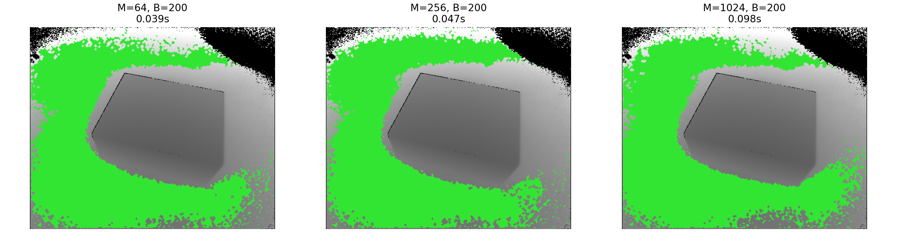

# Report of Box Detection

### Author: Zhiyi Tang, Yifei Li
**Friedrich-Alexander-Universität Erlangen-Nürnberg (FAU)** 

**Date: October 2025**


## 1. Results

### 1.1 Visualization Results

To better illustrate the detection results of floor and box planes, Figure 1 shows the visualization of the estimated planes for four different Kinect datasets.  
The green area corresponds to the detected floor, the red area to the box top, and the blue regions represent remaining background points.

<p float="left">
  
  
  
  
</p>
<p align="center"><b>Figure 1:</b> Visualization of detected planes (top: datasets 1–2; bottom: datasets 3–4).</p>


### 1.2 Quantitative Results

| Dataset        | Height (m) | Length (m) | Width (m) |
| -------------- | ---------- | ---------- | --------- |
| example1kinect | 0.196      | 0.480      | 0.310     |
| example2kinect | 0.196      | 0.474      | 0.306     |
| example3kinect | 0.193      | 0.532      | 0.370     |
| example4kinect | 0.192      | 0.492      | 0.376     |


## 2. Limitations and Recognition Errors

Although the proposed RANSAC-based plane detection method works robustly for most datasets, there are still some recognition errors and unstable results, as illustrated below.

<p align="center">
	
</p>
<p align="center"><b>Figure 2:</b> Example of recognition failure on <code>example3kinect.mat</code>.</p>

### 2.1 Quantitative Evidence

| Dataset        | Height (m) | Length (m) | Width (m) | Observation                  |
| -------------- | ---------- | ---------- | --------- | ---------------------------- |
| example1kinect | 0.188      | 0.482      | 0.315     | Correct detection            |
| example2kinect | 0.190      | 0.479      | 0.311     | Correct detection            |
| example3kinect | **0.056**  | 1.452      | 1.078     | **Wrong** top plane detected |
| example4kinect | 0.184      | 0.495      | 0.378     | Correct detection            |

The third dataset shows a clear recognition error:  
the algorithm mistakenly fitted a large background plane parallel to the floor instead of the actual box top.  
As a result, the estimated height collapsed to only **5–6 cm**, while the length and width exploded to over **1 m**, which does not match the real box dimensions.


### 2.2 Possible Causes

1. **Dominant plane confusion** 

   In `example3kinect.mat`, a large background surface is parallel to the ground and covers more pixels than the top of the box, so RANSAC naturally selects it as the "top" plane because it contains more inliers.
   In Kinect data, there may be reflections or edge points near the ground (such as small bumps on the ground). These points also meet the "parallel to the ground" requirement in non-ground areas and are therefore incorrectly identified as "top of the box."

2. **Fixed global RANSAC threshold** 
   The distance threshold (`0.005 m`) is static and may not adapt well to local noise or small box regions, which makes thin structures less competitive in the model evaluation.


### 2.3 Improvement Suggestions

To make the algorithm more **robust, accurate, and stable**, we propose the following improvements:

1. **Filtering near-ground false positives**

   Since background planes parallel to the floor often have very small height differences (typically 1–4 cm), an additional constraint can be applied to exclude points whose distance to the detected floor is below a certain threshold (e.g., 5 cm). This simple rule effectively removes near-ground “false top” candidates..

2. **Adaptive threshold**
   Use residual statistics (MAD or standard deviation of inliers) to adapt the RANSAC threshold per dataset


## 3. Summary

In summary, while the method performs well on most datasets,  its main limitation lies in **ambiguous top-plane selection** when large background planes exist.  Adding adaptive filtering and local re-fitting would significantly improve robustness without sacrificing simplicity.


## 4. Individual Exercise 1.1: MLESAC

### 4.1 Experiment Setup

We implemented an explicit `mlesac_plane` variant in `src/ransac.py` and evaluated it against baseline `ransac` under the same pipeline.

Settings:

- `epsilon in {0.003, 0.005, 0.007, 0.010}` m
- Same preprocessing and postprocessing
- Same deterministic seed policy

Raw outputs:

- `outputs/mlesac_epsilon_sweep.csv`
- `outputs/mlesac_epsilon_summary.csv`
- `outputs/mlesac_vs_ransac_comparison.csv`

### 4.2 Results (Sensitivity to epsilon)

The metric for sensitivity is the standard deviation of estimated dimensions over different `epsilon` values.

| Method | Mean height std (m) | Mean length std (m) | Mean width std (m) | Mean runtime (s) |
| ------ | ------------------- | ------------------- | ------------------ | ---------------- |
| RANSAC | 0.00544             | 0.00341             | 0.00427            | 3.8741           |
| MLESAC | 0.00084             | 0.00553             | 0.00557            | 4.1537           |

Observation:

- MLESAC significantly improves **height stability** (about 84.5% reduction in mean std).
- For length/width, MLESAC is dataset-dependent: it improves some scenes but degrades on `example4kinect` (see comparison CSV).
- MLESAC is moderately slower (about +0.28 s on average).

### 4.3 Advantages and Disadvantages

Advantages:

1. Uses residual magnitude for inliers, not only binary inlier/outlier voting.
2. More stable when threshold changes, especially for plane-distance (height) estimation.

Disadvantages:

1. Higher computational cost.
2. Still sensitive when different dominant structures compete for inliers in top-plane fitting.


## 5. Individual Exercise 1.2: Preemptive RANSAC

### 5.1 Experiment Setup

We implemented `preemptive_ransac_plane` in `src/ransac.py` and evaluated:

- `M in {64, 256, 1024}` (number of hypotheses)
- `B in {100, 200, 400}` (batch size)
- fixed `epsilon = 0.005`

Raw outputs:

- `outputs/preemptive_ransac_sweep.csv`
- `outputs/preemptive_ransac_summary.csv`

Accuracy is measured as absolute difference to the baseline RANSAC result on the same dataset.

### 5.2 Results (Time Budget vs Accuracy)

`preemptive_tradeoff_ranking.csv` shows two Pareto-optimal settings on this dataset:

| M | B | Mean runtime (s) | Mean abs err height (m) | Mean abs err length (m) | Mean abs err width (m) | Mean abs err total (m) | Pareto |
| - | - | ---------------- | ----------------------- | ----------------------- | ---------------------- | ---------------------- | ------ |
| 64  | 200 | 0.0409 | 0.00150 | 0.00105 | 0.00158 | 0.00138 | Yes |
| 256 | 100 | 0.0536 | 0.00162 | 0.00057 | 0.00125 | 0.00115 | Yes |

Interpretation:

- `M=64, B=200` gives the fastest runtime with low error.
- `M=256, B=100` gives the best aggregate error with only a small runtime increase.
- Larger budgets (e.g., `M=1024`) are not always better in total error here, so tuning is necessary.

Visualization for three time budgets (`M=64,256,1024`, `B=200`) on the floor plane:



### 5.3 Advantages and Disadvantages

Advantages:

1. Significant runtime reduction under tight time budgets.
2. Natural tradeoff control by tuning `M` and `B`.

Disadvantages:

1. Too aggressive preemption can discard good hypotheses early.
2. Parameter choice depends on scene complexity and noise level.


## 6. Reproducibility

Run the full extension suite (MLESAC + Preemptive + comparison tables) with:

```bash
python run_assignment_extensions.py --mode full
```

This command exports:

- `outputs/mlesac_epsilon_sweep.csv`
- `outputs/mlesac_epsilon_summary.csv`
- `outputs/mlesac_vs_ransac_comparison.csv`
- `outputs/preemptive_ransac_sweep.csv`
- `outputs/preemptive_ransac_summary.csv`
- `outputs/preemptive_tradeoff_ranking.csv`

Optional:

- `python run_assignment_extensions.py --mode all` also runs sweeps + comparison and tries visualization.
- If `matplotlib` is unavailable, visualization is skipped while CSV outputs are still generated.
